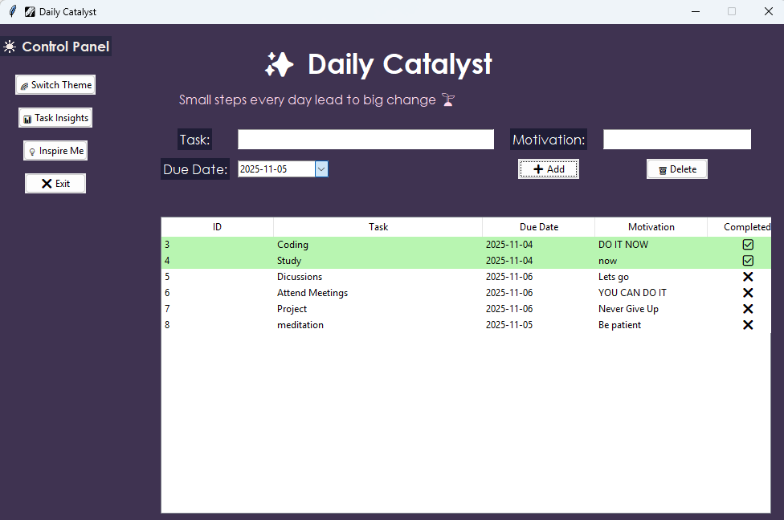
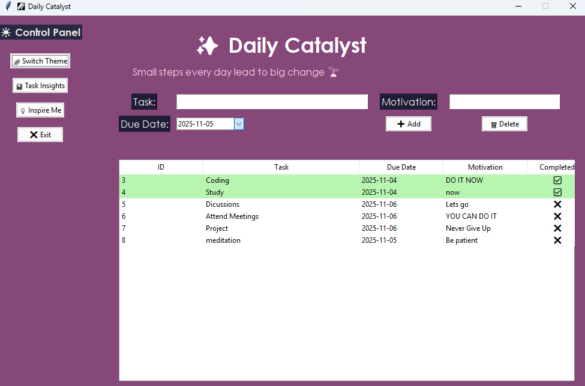
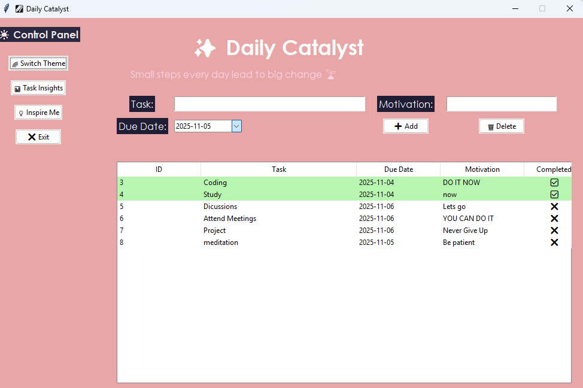
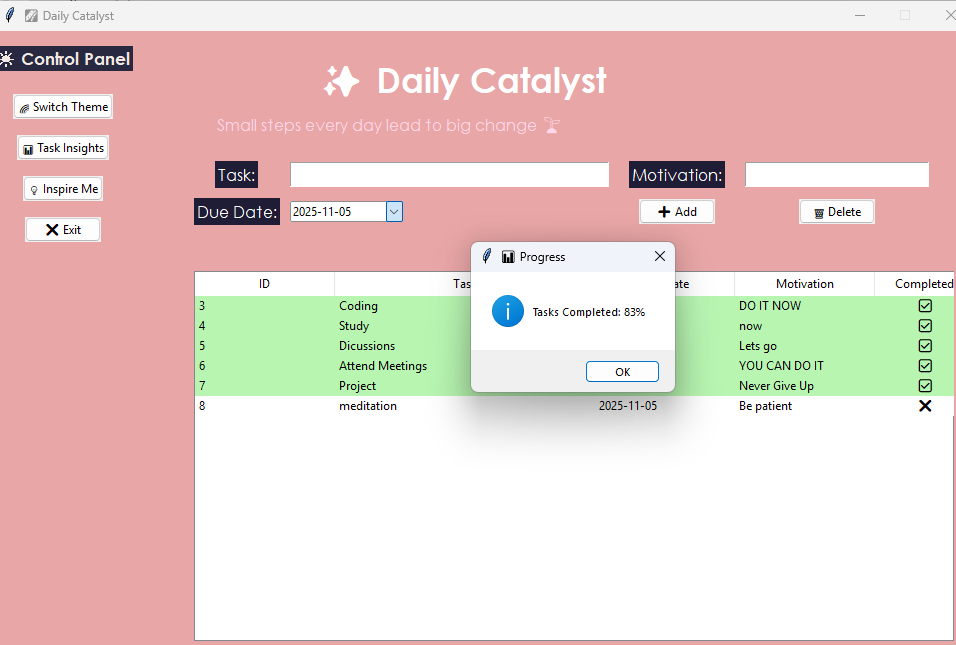
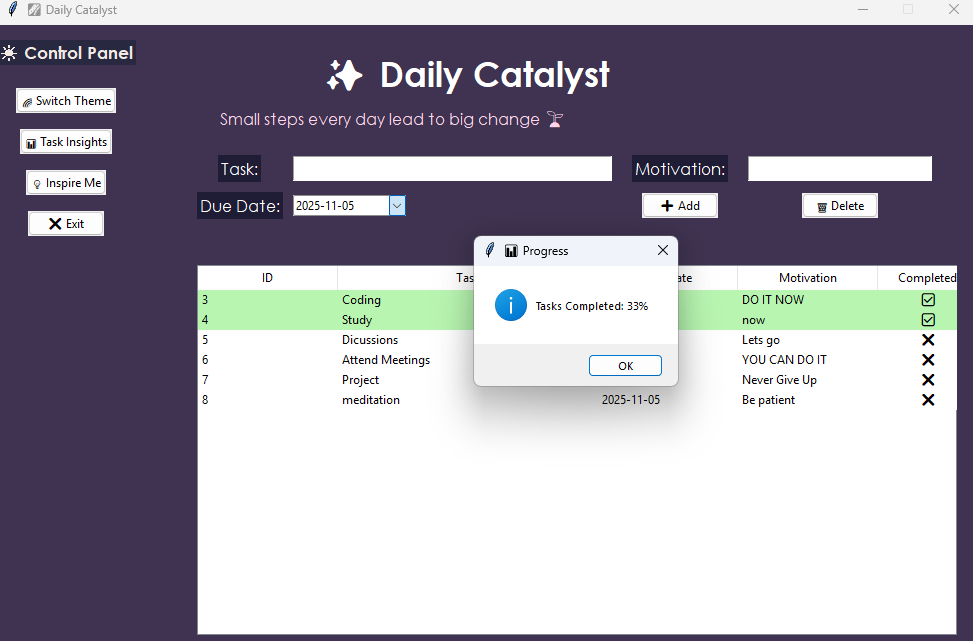

# 🌟 **Daily Catalyst**

**Daily Catalyst** is a beautifully designed desktop productivity app built with **Python, Tkinter, and SQLite**.
It helps you organize daily tasks, stay motivated, and visualize progress — all within an aesthetic, animated interface that makes productivity feel inspiring, not stressful.

---

## 🧠 **Overview**

**Daily Catalyst** serves as your personal digital companion for focus and motivation.
It merges practical task management with calming visuals, motivational quotes, and smooth animations — turning your daily workflow into an experience of mindful productivity.

---

## ⚙️ **Key Features**

✨ **Smart Task Management** – Add, edit, delete, and complete tasks with ease
🗓️ **Integrated Calendar** – View due dates and plan ahead visually
💾 **Persistent Storage** – Tasks stored securely using SQLite
🌌 **Animated Aesthetic Interface** – Dynamic starfield and theme transitions for focus
💬 **Motivational Quotes** – Daily inspiration built into your workspace
🔍 **Search & Filter** – Quickly locate tasks by name or status
⏰ **Reminders & Alerts** – Get notified of upcoming deadlines
🌙 **Dark Mode Design** – Sleek, eye-comforting visuals for long sessions
⚡ **Lightweight & Offline** – Fully functional without internet access

---

## 🧩 **Tech Stack**

| Component            | Technology Used                    |
| -------------------- | ---------------------------------- |
| **Language**         | Python 3.x                         |
| **GUI Framework**    | Tkinter                            |
| **Database**         | SQLite                             |
| **Animation Engine** | Tkinter Canvas & Color Transitions |

---

## 🚀 **How to Run**

### 1️⃣ Clone the Repository

```bash
git clone https://github.com/DikshithaAnand/Daily_Catalyst.git
cd Daily_Catalyst
```

### 2️⃣ Install Dependencies

Tkinter and SQLite are usually preinstalled with Python, but if needed:

```bash
pip install tk
```

### 3️⃣ Run the Application

```bash
python daily_catalyst.py
```

Or open the notebook if running in Jupyter.

---

## 🖼️ **UI Preview**

### 🧭 Main Interface





### 📊 Progress Tracker




---

## ✨ **Author**

👩‍💻 **Dikshitha Anand**

> “Be the catalyst that transforms your daily chaos into creative momentum.”

